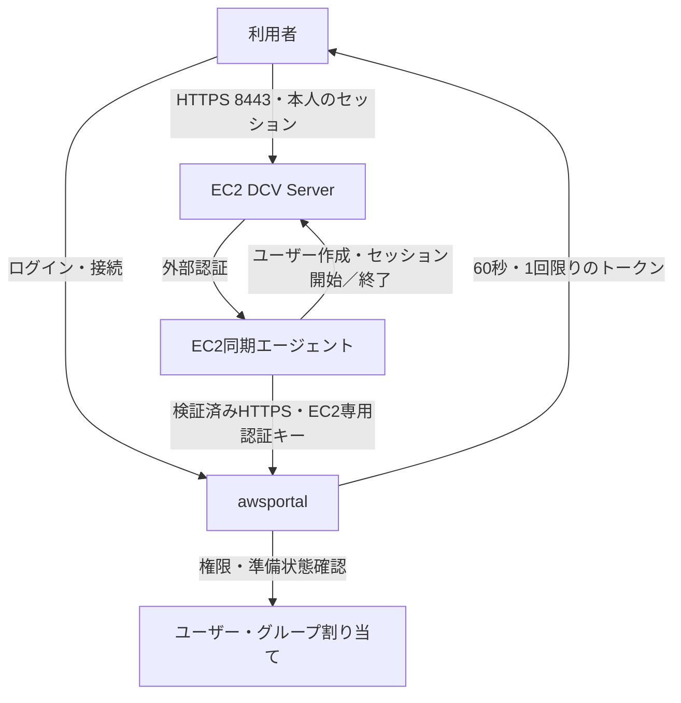

# DCV接続とポータルアカウント同期（v1.4.0）

Ubuntu 24.04（ARM64 / x86_64）の管理対象EC2で、ユーザー・グループ割り当てからOSユーザーと専用仮想デスクトップを自動準備します。ブラウザまたはDCVクライアントで接続し、EC2パスワードの入力・保存・同期は不要です。

## 構成



エージェントはrootで動作し、30秒周期でそのEC2のアカウントだけを取得します。DCVの外部認証先は同じEC2の `http://127.0.0.1:8444`。この仲介サービスが専用キーでポータルへHTTPS照会します。証明書検証は常に有効で、HTTPとリダイレクトへの認証情報転送は拒否します。

## アカウントと権限

| 項目 | 動作 |
|---|---|
| OSユーザー・セッション | `awp-u<ポータルユーザーID>` |
| OS UID | `200000 + ID`。対応IDは1〜1,000,000 |
| ホーム | `/home/awp-u<ID>`、モード0700 |
| OSパスワード | ロック。ポータルのパスワードをEC2へ渡さない |
| 割り当て | 個別権限とグループ権限の和集合。電源操作と接続は別権限 |
| Portal Admin | 全有効インスタンスへの接続権限。sudo/rootは付与しない |
| 無効・期限切れ・パスワード変更待ち | 同期対象から除外 |
| インスタンス無効 | 全ユーザーを除外 |
| 割り当て解除 | 残る権限がなければ本人のDCVと実行中プロセスを終了 |
| データ | OSユーザーとホームを保持。再割り当てで同じUID・ホームを利用 |
| 通信障害 | 新規接続拒否。同期成功から90秒経過後、管理対象セッションを終了 |

管理対象以外のOSユーザー・DCVセッションは変更しません。EC2メタデータ（UserData・IAM資格情報）はrootとDCVシステムユーザーだけに許可し、デスクトップ利用者からのIPv4/IPv6アクセスを永続ファイアウォールで拒否します。EFSのマウントは別途必要です。標準DCV権限は本人への画面・入力・音声出力のみで、ファイル転送、クリップボード、印刷、USB、スクリーンショットを拒否します。外向き通信制御は別途設定してください。

接続時とトークン消費時に最新の権限を照会します。別EC2のキー・別ユーザーのセッション・再利用・期限切れ・古い同期報告は拒否します。既存セッションの終了は次の同期処理に依存します。

## 導入手順

1. Instance AdminでDCVホストと接続方法を保存します。ホストにはDNS名、IPv4、`ec2-public`、`ec2-private` を指定できます。EC2アドレス指定時は接続ごとにAWS APIから最新IPを取得し、停止・再起動によるIP変更に追従します。
2. EC2専用認証キーを保存します。一度だけ表示し、DBにはSHA-256ハッシュのみ保存します。再発行すると旧キーと未使用接続トークンが失効します。
3. リリースアーカイブを対象Ubuntu 24.04へ展開し、rootで `bash dcv/install.sh` を実行します。DCV・Xdcv・Web Viewer・Xfce・systemdサービスを導入します。既存dcv.confはバックアップして専用構成に置き換えるため、共有DCV環境では設定を統合してから適用してください。
4. `/etc/awsportal-dcv/config.json` をroot所有・0600で作成します。

```json
{
  "portal_url": "https://portal.company.example",
  "instance_id": "i-0123456789abcdef0",
  "token": "管理画面で発行した64桁の認証キー",
  "ca_file": "/etc/awsportal-dcv/company-ca.pem"
}
```

公開CAの場合は `ca_file` を省略できます。キーは当該EC2の同期・DCV認証だけに使用できます。

```bash
sudo chown root:root /etc/awsportal-dcv/config.json
sudo chmod 600 /etc/awsportal-dcv/config.json
sudo systemctl enable --now awsportal-dcv-agent
sudo systemctl status awsportal-dcv-agent --no-pager
sudo dcv list-sessions
```

5. SGに利用端末からのTCP8443を許可します。ポータルAPIはDCV EC2からだけ到達できるHTTPS経路で公開し、信頼できるリバースプロキシでTLSを終端し、Authorizationを引き継いでください。22/3389の開放・利用者へのSSM権限付与は不要です。
6. ユーザー／グループを割り当て、準備済みユーザーIDを確認して接続します。ネイティブ方式では利用端末へのDCVクライアント導入が必要です。

EC2のIAMロールには、当該リージョンの `arn:${AWS::Partition}:s3:::dcv-license.${AWS::Region}/*` に対する `s3:GetObject` を許可してください。DCVからS3へのHTTPS到達性も必要です。ラボではこの読み取り権限を設定済みで、S3バケットは新規作成しません。

## ラボの検証

`lab/create.sh` はDCV構成を含む新品のEC2を作成します。既存スタックへの上書きは拒否します。UserDataは更新だけでは再実行されないため、旧ラボは廃棄して作り直してください。

`lab/test-dcv.sh` は管理者のSSMを使い、DCVサービスとライセンス有効状態、labdebugのOSユーザーと仮想セッション、実際のポータルトークンによるHTTPS外部認証、再利用拒否を検証します。利用者へSSM権限を付与するものではありません。

DCVの表示用証明書は自己署名です。表示先URLを一度開き、ラボEC2であることを確認して証明書を許可した後、ポータルから接続してください。内部認証は専用CAで検証します。この内部証明書は7日間有効な一時試験用です。画面描画・マウス・キーボード操作は利用端末で最終確認してください。

## 公式仕様

- [DCV外部認証](https://docs.aws.amazon.com/dcv/latest/adminguide/external-authentication.html)
- [Linuxへの導入](https://docs.aws.amazon.com/dcv/latest/adminguide/setting-up-installing-linux-server.html)
- [仮想セッション作成](https://docs.aws.amazon.com/dcv/latest/adminguide/managing-sessions-start.html)
- [セッション権限](https://docs.aws.amazon.com/dcv/latest/adminguide/security-authorization-file-create-permission.html)

- [EC2のDCVライセンス設定](https://docs.aws.amazon.com/dcv/latest/adminguide/setting-up-license.html)

## DCV機能の管理者設定（v1.5.0以降）

Instance Adminの各EC2で「DCV機能・持ち出し制御」を開き、許可する機能だけをチェックします。設定版とEC2適用版を表示し、一致するまで新規接続・未使用トークンを拒否します。設定保存はPortal Adminだけに許可します。一般ユーザーとGroup Adminは、URLを直接呼び出しても変更できません。操作と機能一覧は監査ログに記録します。

初期設定は画面・キーボード・マウス・ポインター・音声出力だけを許可します。その他のDCV機能は明示的なdenyで禁止します。所有者不在の共同利用は固定禁止です。キャプチャ禁止とクリップボード持ち出し許可の組み合わせも拒否します。クライアントやサーバーの非対応機能は、チェックだけでは利用できません。ファイル転送許可時のストレージは本人のホームです。

EC2エージェントは、root所有のサーバー共通権限ファイルを `/etc/awsportal-dcv/enforced.perm` に保存し、`[session-management/defaults] permissions-file` に設定します。共通ファイルのdenyは、セッションごとの許可やbuiltinへの変更でも上書きできません。各セッションはrootが所有し、`--user awp-u<ID>` で本人の非特権OSユーザーとしてデスクトップを実行します。本人にはDCVセッション管理権限を渡しません。EC2側では各同期で管理者のセッション権限を再適用します。

共通権限はセッション作成時に読み込まれるため、設定変更時には既存DCVセッションを閉じ、次の同期で新しい設定のセッションを準備します。デスクトップ上のアプリは終了します。ホームは削除しません。一般ユーザーにsudo/root、dcv・docker・lxd等の特権グループ、SSM、EC2のIAM設定変更権限を付与しないことが前提です。root権限を持つ管理者やOSの脆弱性まで「絶対に変更不能」と保証するものではありません。

DCVのscreenshot禁止はクライアント内のスクリーンショット保存を禁止します。Windows/macOSネイティブクライアントではOSのキャプチャツールによる取得も抑止します。WebブラウザとLinuxクライアントのOSキャプチャ、カメラ撮影、端末側での改変までは防げません。外部キャプチャ抑止が必要なら接続方法をnativeにし、管理されたWindows/macOS端末で利用してください。ポータルの接続方法指定だけでは別クライアントの利用を強制排除できないため、端末側の統制も必要です。外向き通信やVPN経由の持ち出し制御は別途必要です。

### 既存環境の更新

ポータルのバイナリだけではEC2側の強制設定は入りません。各DCV EC2で新しい配布ファイルを展開し、rootで `bash dcv/install.sh` を再実行します。設定のバックアップ後にDCVサーバーを再起動するため、接続中の画面は終了します。認証キーと既存のroot専用config.json、ホーム、ユーザーID対応表は保持します。同期エージェントも最新版へ再起動してください。

```bash
sudo bash dcv/install.sh
sudo systemctl restart awsportal-dcv-agent
sudo systemctl status awsportal-dcv-agent --no-pager
```

旧エージェントは適用版を報告できないため、新ポータルでは準備済みとして扱いません。管理画面で設定版と適用版の一致を確認してください。ラボは旧スタックを廃棄して新規作成します。

- [DCVセッション権限変更](https://docs.aws.amazon.com/dcv/latest/adminguide/managing-session-perms.html)
- [サーバー共通権限設定](https://docs.aws.amazon.com/dcv/latest/adminguide/config-param-ref.html)
- [DCVスクリーンショット制限](https://docs.aws.amazon.com/dcv/latest/userguide/saving-a-screenshot.html)
