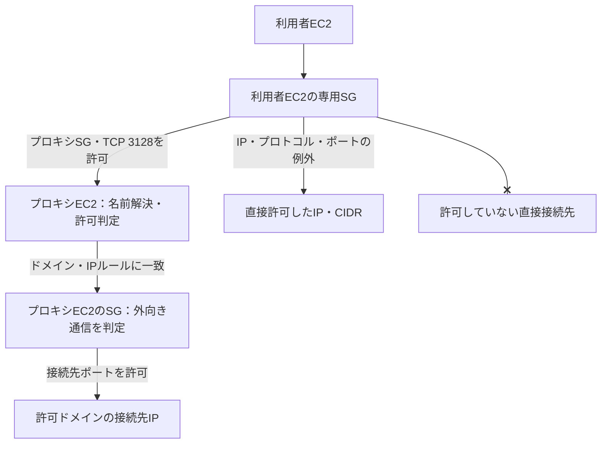

# ポータルからの利用者EC2 outbound制御

Portal AdminのOutbound画面でEC2ごとのIP/CIDRルールを保存し、保存版をAWSへ適用する。ドメイン・IP/CIDRを認証付きHTTP/HTTPSプロキシで制御するルールはProxy画面に置く。

## 構成図と通信経路

通常の外部通信はプロキシを経由し、社内サービス等の必要なIPだけを直接許可する。利用者EC2とプロキシEC2は別のEC2であり、それぞれのSGが別々に通信を判定する。awsportalのWebポータルとプロキシは、同じポータルEC2上で動作できる。

TCP3128は既定のプロキシポート。プロキシEC2のSGには、利用者EC2の専用SGからこのポートへの受信許可も必要。非ループバックのプロキシ接続はTLSで保護する。

### ドメインで引いたIPは、どのSGで判定されるか

**プロキシ経由の外部IPを、利用者EC2のSGへ登録する必要はない。** 利用者EC2が接続する相手はプロキシであり、接続先ドメインを名前解決して外部IPへ接続するのはプロキシEC2である。名前解決したIPが変わっても、利用者EC2のSGをその都度更新しない。

| 通信 | SGが判定する接続先 | 許可を設定する場所 |
|---|---|---|
| 利用者EC2 → プロキシ | プロキシSG・プロキシポート | Outbound画面＋プロキシSGの受信設定 |
| プロキシ → 名前解決した外部IP | 外部IP・接続先ポート | プロキシEC2のSG。ドメイン/IPの許可判定はProxy画面のルール |
| 利用者EC2 → 外部IPへ直接接続 | 外部IP・接続先ポート | Outbound画面の直接IP/CIDR例外 |

たとえば `github.com:443` をProxy画面で許可する場合、利用者EC2のSGではプロキシへの接続だけを許可する。プロキシがgithub.comを名前解決し、現在のIPに対してルールを検査して接続する。外部への443番接続はプロキシEC2自身のSGで許可されている必要がある。

プロキシを使わずgithub.comへ直接接続すると、名前解決したIPが利用者EC2の直接IP例外に含まれない限り拒否される。これはプロキシの迂回を防ぐための動作である。

### 実装上の役割

| 実装 | 役割 |
|---|---|
| `cmd/awsportal/egress_admin.go` / `web/egress.html` | 管理者による保存、AWS適用、状態確認 |
| `internal/aws/egress.go` | 専用SGを検査し、outboundをプロキシ＋直接IP例外へ置換 |
| `internal/store/egress.go` | EC2ごとの直接IP例外と保存版・適用版を保持 |
| `internal/store/proxy.go` | ドメイン/IP/CIDR、ユーザー/グループ、許可/拒否を判定 |
| `internal/proxy/proxy.go` | プロキシ自身が名前解決し、検査したIPへHTTP/CONNECT通信を転送 |
| `terraform/main.tf` | 専用SG、プロキシへの受信許可、対象SGに限定したIAM権限を準備 |

この図は実装した構成の説明であり、AWS実環境への適用・疎通確認済みを示すものではない。初回準備と実機試験は以下の手順に従う。

## 2つの制御の関係

| 設定 | 対象 | 意味 |
|---|---|---|
| Outbound: IP/CIDR、TCP/UDP、ポート範囲 | EC2全体 | 直接接続を許可する例外。OS上のユーザーに関係なく適用 |
| Outbound: プロキシSG・ポート | EC2全体 | ドメイン制御に必要な唯一の通常出口 |
| Proxy: ドメイン/IP/CIDR、メソッド、ポート、ユーザー/グループ、許可/拒否 | プロキシ経由 | 未登録拒否、拒否優先。ドメインまたはIPの許可が必要 |

IPを直接許可した場合、そのIPで動く全ドメインにも該当ポートで接続できる。ドメイン限定の通信をIPの直接許可とAND結合するものではない。ドメイン限定なら、EC2側はプロキシだけを許可し、Proxy画面で接続先を絞る。ドメイン/IPの両方をプロキシで設定した場合、DNSで返った全IPについて判定し、IP拒否に一致すればドメイン許可があっても拒否する。検査したIPに接続し、DNS再解決による迂回を防止する。

IPv4/IPv6の単一IP（/32、/128へ正規化）とCIDR、TCP/UDP、1〜65535の単一ポートと範囲を扱う。直接許可は最大50行。空欄はプロキシ以外の直接通信を許可しない。SGはallow-onlyのため、IPの除外は許可一覧を狭めて表現する。プロキシ側には許可と拒否がある。

## 初回のインフラ準備

EC2のSGは複数を併用すると許可が合成される。ポータルは、単一ENI・専用SG1個だけが付いた登録済みEC2に限定する。SGに `awsportal:egress-instance=<EC2 ID>` のタグが必要。他ENIとの共有・別VPC・別SGの併用・複数ENIはAWS変更前に拒否。受信ルール、ENIへのSG割り当て、ルートはポータルから変更しない。

Terraformの `managed_egress_instance_ids` に対象EC2 IDを追加して適用すると、専用SGと限定IAM権限が作られる。SGは最初は外向き許可なし、受信はcorporate_cidrsからDCV8443のみ。ポータルSGには対象SGから3128への受信を追加。SG自体に新たな常時課金リソースはない。

初回は運用者が、必要な受信ルールを確認したうえで、その専用SGだけを利用者EC2に割り当てる。これによりSSM等の既存接続が失われ得るため、ポータル設定保存、必要な送信先の整理、復旧経路準備を先に行う。ポータルが稼働するEC2やプロキシEC2にはこの専用SGを割り当てない。一般ユーザーにENI/SG/ルート変更のIAM権限を付与しない。

既存の独自SGを使う場合、同じタグを付け、Portal IAMに対象SG ARN限定で `AuthorizeSecurityGroupEgress` / `RevokeSecurityGroupEgress`、読取用のDescribeInstances/DescribeSecurityGroups/DescribeNetworkInterfacesを付与する。AWS変更権限を全SGへ拡大しない。

プロキシは利用者EC2とは別のEC2で稼働させ、非ループバックTLSリスナーを構成する（docs/12-proxy.md）。利用者OS/ツールのHTTPS_PROXY/HTTP_PROXY設定、HTTPSプロキシ証明書信頼は別途設定する。設定しないツールの直接通信は、IP例外に一致しなければ拒否される。プロキシは既定443の外向きSG定義なので、HTTP80を使う際はプロキシEC2のSGも調整する。

## ポータルでの操作

1. Outboundで、対象EC2の専用SG ID、プロキシSG ID、ポート（既定3128）を指定。
2. 必要な直接許可を1行ずつ記入。例：`10.20.0.0/16 tcp 443`、`192.0.2.10 udp 123`、`2001:db8::/64 tcp 443-444`。
3. 「保存（未適用）」で新しい保存版を作成。保存だけではAWSを変更しない。
4. 「AWS状態確認」で、SGの構成条件と保存版との一致を確認。
5. 「保存版をAWSへ適用」で、既存outboundを削除し、プロキシ＋IP例外だけを追加。受信は変更しない。AWSの設定一致確認後だけ最終適用版を更新する。
6. Proxy画面でドメイン/IP/CIDRの許可・拒否、ユーザー/グループとトークンを管理する。

適用は削除→追加の順で一時的に通信が途切れる。追加失敗時に広い旧許可を復元しない。エラーを記録し、実際のSG状態を確認して再適用する。AWS外で変更されたSGは状態確認で不一致として表示。保存版と最終適用版の番号は現在のAWS状態を保証しない。古い画面の保存版を適用する要求は409で拒否し、同一Portalプロセスの適用/保存を直列化する。複数Portalプロセスによる同時運用には未対応。

SSM、OS更新、DCV外部認証、EFS、時刻同期等の必要通信がある。プライベートVPC Endpointや内部サービスは直接IP/CIDR例外で許可する。内部IPへのプロキシ転送は引き続き拒否する。

## 適用後の実機確認と限界

許可ドメインのプロキシ経由成功、未許可ドメインの403、HTTPS_PROXYを外した外部IPへの直接443失敗、許可IP/ポートの成功、未許可ポートの失敗を利用者EC2から確認する。IPv6を使う場合はIPv6でも同じ試験を行う。別SGが追加された場合は状態確認/次回適用を拒否するが、AWS外での変更を常時監視/自動修復する機能はない。

SGはstatefulで既存接続が直ちに切断されない場合がある。既存セッションを終了して新規接続で評価する。VPCのAmazonProvidedDNSをSGでは遮断できない。DNSクエリ自体のドメイン制限/外部への情報流出対策にはRoute 53 Resolver DNS Firewall等を別途設計する。IMDS/一部リンクローカルサービスもSGだけで全面禁止する機能ではない。

HTTPS内部のURL、メソッド、SNIは検査しない。CONNECT許可はその接続先TCPへの許可であり、許可先を中継サーバーとして使う通信やCDNの共有IPでのHost/SNI差し替えまで保証しない。DNS FirewallやTLS検査が必要な要件は別途扱う。

DBは自動移行でテーブルと接続先種別列を追加し、従来のドメインルールを保持。事前バックアップ推奨。AWS実環境での適用/疎通試験は未確認。自動試験はAWS API mock・実HTTP/HTTPS・ブラウザで拒否条件、適用順、失敗時状態、CIDR/ドメイン判定を検証する。
