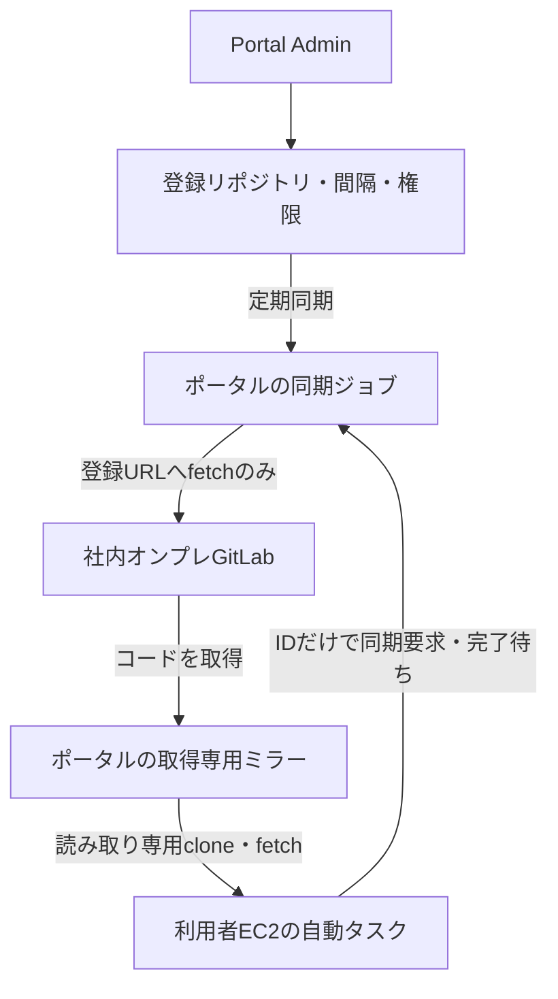

# GitLab取得専用ミラーと自動化

Portal AdminがGit Mirrors画面で上流GitLabのHTTPSリポジトリ、既定ブランチ、同期間隔、利用者/グループを設定する。利用者EC2はポータルの専用トークンで登録済みIDの同期を要求し、ジョブ成功を待ってからclone/fetchする。上流URL・ブランチ・コマンド・任意の本文を同期APIに渡せない。



これはデータの流れを表す。GitLabとのHTTPS通信自体は要求/応答の双方向通信だが、利用者のGit要求やファイルを上流へ転送しない。利用者のclone/fetchはポータル内のbare repositoryだけを読む。ポータルはGitLabへfetchしか行わず、pushしない。GitLabで利用者にwrite権限があっても、ポータルのHTTP入口でreceive-pack、API、任意ファイルを拒否する。

## ポータルEC2の準備

- OSのGit、git-http-backend、Python3とGit LFS（利用者コマンド側）が必要。GitはOS提供のセキュリティ更新を適用する。
- `AWSPORTAL_MIRROR_ROOT=/var/lib/awsportal/mirrors` を設定してawsportalを再起動すると、同期workerが起動する。未設定なら機能は起動せず、同期/配布APIは503。
- `AWSPORTAL_MIRROR_CREDENTIAL_DIR=/etc/awsportal/git-credentials` を指定。資格情報ファイルはPortal実行ユーザーだけ読める0600、親ディレクトリ0700で準備する。
- 認証情報の参照名 `gitlab-read` に対応するファイルは `gitlab-read.json`。内容は `{"Username":"認証ユーザー名","Token":"GitLabトークン"}`。画面には参照名だけを登録し、トークンをURLやDBに保存しない。資格情報は上流fetchの子プロセス環境へ渡し、引数・ジョブ結果・監査ログには出さない。
- GitLabに社内CAを使う場合、`AWSPORTAL_MIRROR_CA_FILE=/etc/awsportal/gitlab-ca.pem` で信頼するCAを指定。TLS検証を無効化しない。上流HTTPリダイレクトは拒否する。
- ポータルの外向きSG/ルート/VPN等で社内GitLabのHTTPS到達性を用意。オンプレのプライベートIPでも、ポータルから直接同期できる。汎用プロキシの内部IP拒否を解除する必要はない。
- APIとGit配布はPortalのHTTPS経路（通常443）に公開する。現在のGo Web listener自体はHTTPなので、既存TLS終端/リバースプロキシ等で保護する。ラボの平文8080へ実用トークンを流さない。
- `enable_mirror_access=true` をTerraformで指定すると、管理対象EC2の専用SGからPortal SGの443受信を許可する。利用者EC2のOutboundに**ポータルのプライベートIP/32（IPv6なら/128）・tcp・443**を直接許可する。通常のプロキシ3128とは別の経路。
- 利用者EC2からGitLabへの直接IP許可、SSH22、汎用プロキシ経由のGitLab CONNECT許可は設定しない。GitLabへ直接届く経路が残れば、ミラーによる書き込み禁止を迂回できる。

## 管理画面

1. Git Mirrorsで名前、`https://gitlab.example/team/repo.git`、認証情報参照名、既定ブランチ、同期間隔を登録。間隔0は自動同期なし、1〜10080分は定期同期。
2. ユーザー/グループに「読み取りのみ」または「読み取り＋同期要求」を割り当てる。複数の割り当ては許可を合成する。
3. 自動化用トークンをユーザーごとに発行。トークンにも読み取り/同期権限があり、実行時はユーザーの現在の割り当てとANDで判定。有効期限は1〜90日、失効可能。表示は発行時だけでDBにはハッシュを保存。
4. 「同期を要求」で初回同期し、「状態更新」でjobがsuccessになるのを確認。初回成功前のcloneは409。

上流URLは登録後変更不可。別のURLは新しいIDで登録する。認証情報の参照、ブランチ、間隔、有効/無効は変更可能。無効化は新規読み取りと同期要求を拒否する。実行中の同期/既存読み取りを即時切断する機能ではない。

## 利用者EC2のコマンド

ポータルの同梱クライアントをHTTPSで利用者EC2へダウンロードできる。GitLabやGitHubへの直接接続は不要。リポジトリの `scripts/awsportal-mirror` と同一内容を配布する。

```sh
mkdir -p "$HOME/.local/bin"
curl --fail --silent --show-error --cacert /etc/ssl/certs/portal-company-ca.pem \
  https://portal.example/static/web/awsportal-mirror.py \
  -o "$HOME/.local/bin/awsportal-mirror"
chmod 755 "$HOME/.local/bin/awsportal-mirror"
mkdir -p "$HOME/.config/awsportal"
chmod 700 "$HOME/.config/awsportal"
# mirror.jsonを安全な方法で作成し、下記の内容を設定する
chmod 600 "$HOME/.config/awsportal/mirror.json"
```

設定ファイルの例（トークンはGitLab資格情報と別）：

```json
{
  "portal_url": "https://portal.example",
  "token": "ポータルで発行した専用トークン",
  "ca_file": "/etc/ssl/certs/portal-company-ca.pem"
}
```

OSの信頼ストアで証明書を検証できるならca_fileは省略する。設定ファイルは0600の通常ファイルに限定し、リダイレクトは追跡しない。クライアントはポータルに直接接続し、環境のHTTP_PROXY/HTTPS_PROXYを使わない。トークンはコマンド引数に渡さない。

```sh
# ID 1の上流同期を要求し、最大900秒待つ。エラー/タイムアウトは終了コード1。
awsportal-mirror sync 1 --wait

# 初回のコード取得
awsportal-mirror clone 1 ./source

# 既存作業ツリーの取得。originが登録ミラーURLと一致する場合だけ実行。
awsportal-mirror fetch 1 ./source
# 必要なら作業ツリーを明示的に更新（クライアントが勝手にreset/上書きしない）
git -C ./source merge --ff-only origin/main
git -C ./source lfs checkout

# 待たずにジョブIDだけ受け取り、後から状態を確認
awsportal-mirror sync 1
awsportal-mirror status 42
```

自動タスクの例：

```sh
set -eu
awsportal-mirror sync 1 --wait
if [ ! -d ./source/.git ]; then
  awsportal-mirror clone 1 ./source
else
  awsportal-mirror fetch 1 ./source
  git -C ./source merge --ff-only origin/main
  git -C ./source lfs checkout
fi
# 同期とコード更新が成功した場合だけ、ここでビルド/タスクを実行する
```

設定場所を変える場合は `awsportal-mirror --config /private/mirror.json ...`。GitLabのトークンは利用者EC2に配布しない。専用トークンもそのユーザーの秘密情報として保護する。

## APIと動作

| API | 認証・権限 | 応答 |
|---|---|---|
| POST `/api/mirrors/{id}/sync` | Bearer専用トークン＋同期権限 | 202、job_idとstatus_url。本文/クエリは受け付けない |
| GET `/api/mirror-jobs/{id}` | Bearer専用トークン＋対象repoの読み取り権限 | queued/running/success/error |
| `/git/mirrors/{id}/info/refs?service=git-upload-pack` | 専用トークン＋読み取り権限 | Git参照一覧 |
| POST `/git/mirrors/{id}/git-upload-pack` | 専用トークン＋読み取り権限 | ミラー内のGitオブジェクト |
| receive-pack、その他のサービス/ファイル/API | 常に拒否 | 403 |

Git配布はBearer、またはユーザー名＋専用トークンのBasic認証に対応。ポータルのCookie/パスワードやGitLabの資格情報を使わない。無効化・期限・初回パスワード変更・現在のグループ所属をリクエストごとに確認。ミラーの認可済みAPI利用はアカウントのアクセスとして扱い、30日未アクセス期限を延長する（Webログイン時刻は変更しない）。すでに期限切れ・無効なアカウントを復活させない。トークン自体の有効期限は延長しないため、定期的な更新が必要。

ジョブはSQLiteへ永続化。同じrepoのqueued/running要求は同じjob IDにまとめる。完了後の再要求は30秒以上空ける（429、Retry-After:30）。CLIの--waitはこの待機も期限内で自動再試行する。単一workerが同期を直列実行し、同期開始時に要求者の現在の権限を再検査する。定期同期は最後の要求時刻から設定間隔を空け、失敗時の過剰再試行を防ぐ。workerは5秒間隔でキューを確認し、fetchは最長10分。CLIのタイムアウトはジョブ自体をキャンセルしない。

Git fetchは非公開のステージング参照へ行い、LFS同期成功後に公開refsをgit update-refのトランザクションで更新する。初回成功前は公開しない。同期失敗でも前回成功したミラーは残り、--waitが失敗した自動タスクは終了コードで停止できる。再起動時のrunningはerrorにし、queuedは引き継ぐ。単一Portalプロセスでの運用に限定する。

## Git LFS

LFSのSHA-256 pointerを全ブランチ/タグ履歴から検出し、上流の固定URL `<登録Git URL>/info/lfs/objects/batch` へdownloadだけを要求する。リポジトリ内の`.lfsconfig`で同期先を変えない。取得したオブジェクトはサイズとSHA-256を検証し、ポータル内へ保存する。キャッシュも同期時に検証し、破損時は再取得する。LFS同期に失敗した場合は公開Git参照を更新しない。

利用者向けのBatch APIもdownloadだけを受け付け、ローカルmanifestにある当該repoのOID/サイズだけを配布する。利用者の要求から上流の取得を起動しない。upload、verify、locks、削除は拒否する。オブジェクトのRange取得に対応。初回同期前は取得できない。

- 管理者の「表示設定」で、**利用者EC2から届くポータルHTTPS URLを設定**する。LFSのdownload URLはこの値から作成する。未設定のLFS batchは503。
- ポータル側はGoでLFS同期・配布するため、Git LFSバイナリは不要。利用者EC2は`git-lfs`をインストールする（例：Ubuntuの`sudo apt-get install git-lfs`）。
- 同梱クライアントのcloneはLFS実体も取得する。fetchは更新されたremote refsのLFSをキャッシュし、作業ツリーを変更しない。merge後に`git lfs checkout`でキャッシュから実体を展開する。トークンは環境経由のHTTPヘッダーで渡し、Git設定に保存しない。
- `.lfsconfig`に別URLがあっても同梱クライアントはポータルURLを固定し、basic転送だけを使用する。ローカルGit設定にもポータルLFS URLとskip-smudgeを設定する。
- 上流GitLabと同じHTTPS originのdownload URLだけを既定で許可。外部ストレージを使う場合は`AWSPORTAL_MIRROR_LFS_DOWNLOAD_ORIGINS`にHTTPS originをカンマ区切りで登録し、ポータル側のネットワーク到達性も用意する。GitLab資格情報はそのストレージへ転送しない。上流が返すdownload action専用ヘッダーは適用する。リダイレクトは追跡しないため、最終的なダウンロードURLがbatchで返る構成が必要。
- 既定の上限は1オブジェクト10GiB、1回の同期で新規/修復取得する合計50GiB。`AWSPORTAL_MIRROR_LFS_MAX_OBJECT_BYTES`と`AWSPORTAL_MIRROR_LFS_MAX_SYNC_BYTES`でバイト数を変更できる。既存の10分同期タイムアウト内に完了する必要がある。
- メタデータ走査は最大200万Gitオブジェクト、1回の小さいblob候補は10万、LFS manifestはrepoごと最大10万件。オブジェクトはストリーム保存し、ファイル全体をRAMに載せない。配布はGitと共通で最大4並列、LFS配布のwrite deadlineは10分。TLS終端側にも必要な転送時間を確保する。
- 履歴から削除されたオブジェクトも、そのrepoのキャッシュ/manifestには保持する。自動GC・容量管理は未実装。ディスク容量と転送量を監視する。pointer拡張、SSH LFS、カスタムtransfer、LFS lockは対象外。

実Git LFSクライアントで、HTTPS上流同期・clone実体化・fetch、upload拒否・未知OID拒否・Range取得、破損修復・LFS不正時のGit参照維持、外部storageの明示許可と資格情報非転送を検証する。社内GitLab/S3実機と大規模データでの性能は別途確認する。

## 制約・テスト・終了

GitLab API、添付ファイル、CI artifact、submoduleの自動再帰取得は未対応。必要なsubmoduleは個別のミラーIDで登録して明示的に扱う。リポジトリ履歴を含むbare mirrorがPortalディスクへ保存されるため、ディスク容量・暗号化・バックアップ・アクセス権を運用で管理する。大規模リポジトリと低メモリEC2の実容量/性能は実機確認が必要。

Git push禁止だけで、全通信経路からのデータ漏洩を保証しない。他のIP例外・許可ドメイン・DNS・DCV転送等も制御する。ミラー機能だけでは利用者EC2のSGを自動変更しない。

自動テストは実Git＋HTTPS上流で同期・clone/pull・push拒否・任意ファイル拒否、トークン/割り当て/期限/ジョブ重複/再起動、CLIのHTTPS完了待ち、ブラウザ設定を確認。社内GitLab/AWS実機との疎通は未確認。

テスト終了時はミラー無効化、専用トークン失効、AWSPORTAL_MIRROR_ROOT解除とサービス再起動。不要なミラーディレクトリと資格情報は運用者が確認して削除する（画面からデータ削除は未実装）。SG/EC2等を作成した場合、その停止/削除は別途行う。機能を無効化するだけではEC2/EBSの課金は止まらない。
